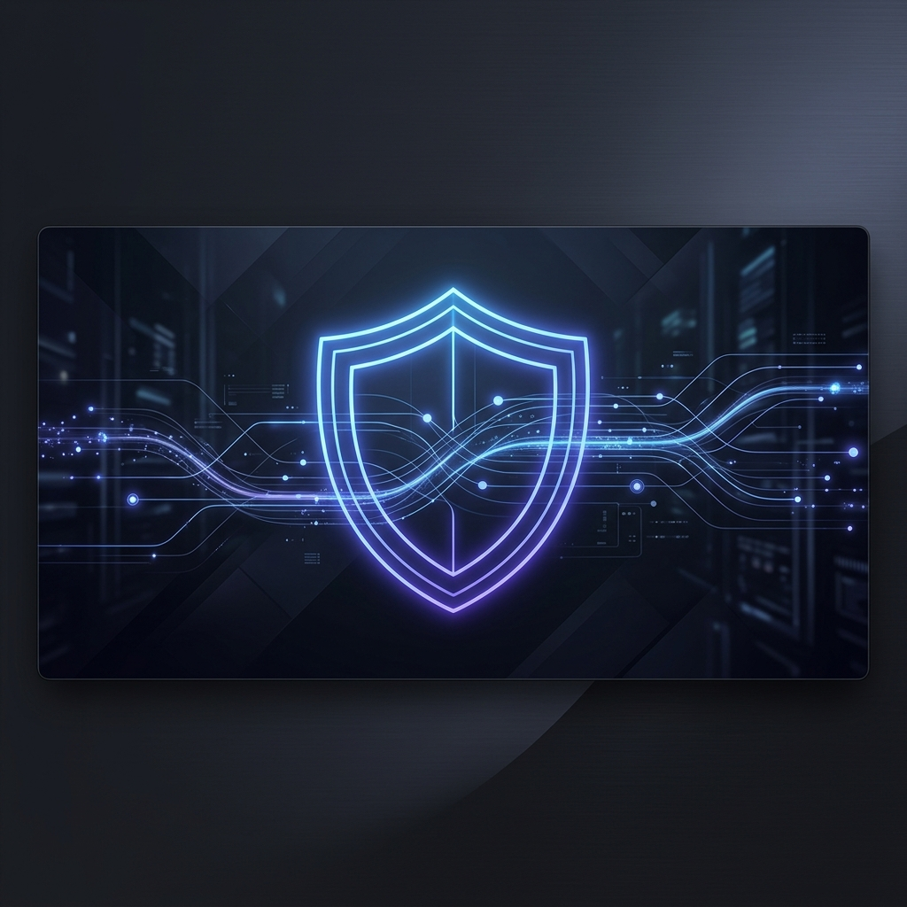

# 🛡️ Freenet (macOS)

<p align="center">
  
</p>

<p align="center">
  <a href="https://img.shields.io/badge/Platform-macOS%2013.0+-apple?style=flat-square&logo=apple"></a>
  <a href="https://img.shields.io/badge/Swift-5.0-orange?style=flat-square&logo=swift"></a>
  <a href="https://img.shields.io/badge/License-MIT-green?style=flat-square"></a>
  <a href="https://img.shields.io/badge/Status-Active-success?style=flat-square"></a>
</p>

<h3 align="center">Bypass censorship. No account. No subscription. Just click.</h3>

Freenet is the ultimate, **zero-configuration** hybrid internet censorship bypass tool for macOS. Inspired by the legendary GoodbyeDPI, but custom-built natively in Swift for Mac. It lives quietly in your menubar and frees your internet with a single click.

🇹🇷 **[Türkçe dokümantasyon ve Rehber için tıklayın (Turkish README)](README.tr.md)**

---

## ✨ Why Freenet? (The Two Engines)

Censorship systems vary. Freenet provides two specialized engines to defeat them, giving you the best of both worlds:

### 1. 🚀 DPI Mode (Zero Speed Loss)
*   **The Problem:** Your Internet Service Provider (ISP) acts like a mailman inspecting the label on your packages. If it says "youtube.com", they throw it away (Deep Packet Inspection).
*   **The Freenet Solution:** Freenet slices that label into tiny pieces ("you" + "tube.com") using a local engine (`ciadpi`). The ISP's firewall gets confused and lets the traffic pass.
*   **The Magic:** Your traffic goes *directly* to the destination. There is **no VPN, no middleman, and absolutely zero speed loss.** You get your raw, maximum internet speed. *(Note: This bypasses blocks, but does not hide your real IP).*

### 2. 🌍 WARP Tunnel Mode (The Heavy Armor)
*   **The Problem:** Some governments completely block the IP addresses of certain websites. Slicing the package label doesn't work if the destination address itself is banned.
*   **The Freenet Solution:** Freenet automatically builds a secure, encrypted WireGuard tunnel using Cloudflare's massive global infrastructure (WARP). It routes your entire traffic through this indestructible "pipe".
*   **The Magic:** Bypasses absolute IP bans, DNS poisoning, and hides your real IP address. It protects you on public Wi-Fi networks.

---

## 🎩 The "Magic" Features

Freenet isn't just another proxy app. It's designed to feel like a native Apple system service.

*   **⚡ Zero Friction Auto-Install:** Click "WARP Mode" for the first time? Freenet silently downloads the required packages (`wgcf`, `wireguard`), registers a free Cloudflare profile, and builds the tunnel. You don't ever need to touch the Terminal.
*   **🔓 Passwordless 1-Click Toggle:** Changing proxy settings usually requires your Mac password every single time. Freenet asks for permission *once* during setup to securely whitelist its commands. From then on, toggling takes 1 second, password-free.
*   **🧠 Self-Healing Autopilot:** Close your MacBook's lid or change Wi-Fi networks? VPNs usually drop and leave you disconnected. Freenet detects the drop instantly and **automatically restarts the tunnel** in the background. You're never left without internet.
*   **📊 Live Matrix Dashboard:** Geeks will love the real-time, Matrix-style live log viewer that shows exactly how your packets are being fragmented.

---

## 📦 One-Command Install

To install Freenet, simply open your Terminal (`Applications > Utilities > Terminal`) and paste this single command:

```bash
curl -fsSL https://raw.githubusercontent.com/Baro007/freenet/main/install.sh | bash
```

*This will automatically clone, build, and install the app to your `/Applications` folder.*

---

## 🤝 Credits & Acknowledgements
- [ciadpi (ByeDPI)](https://github.com/hufrea/byedpi) - The core DPI bypass engine.
- [WireGuard](https://www.wireguard.com/) & [Cloudflare WARP](https://1.1.1.1/) - The tunnel infrastructure.
- [GoodbyeDPI-Turkey](https://github.com/cagritaskn/GoodbyeDPI-Turkey) & [SplitWire-Turkey](https://github.com/a-mertdincer/SplitWire-Turkey-macOS) - Community inspirations.

## 📝 License
MIT License. See [LICENSE](LICENSE) for details.
